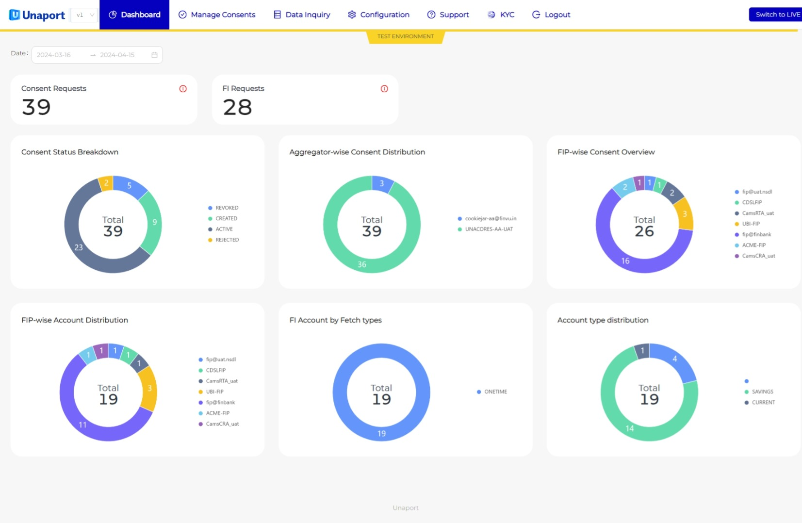
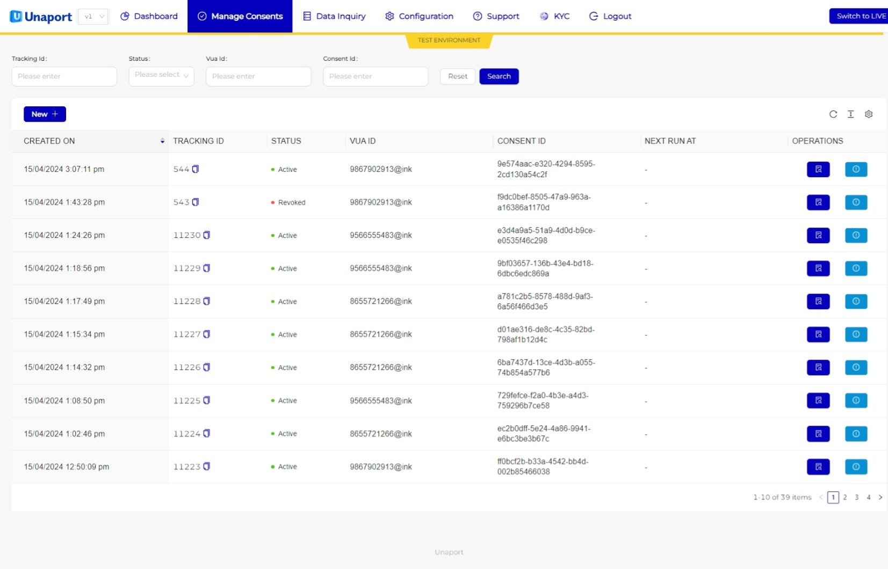
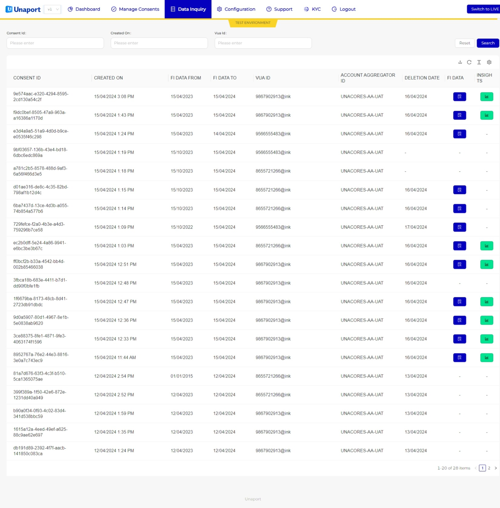
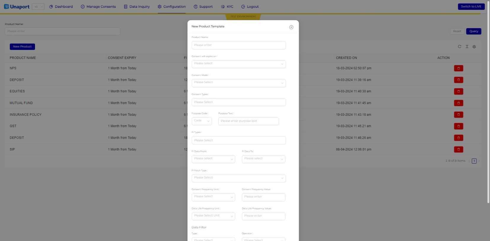
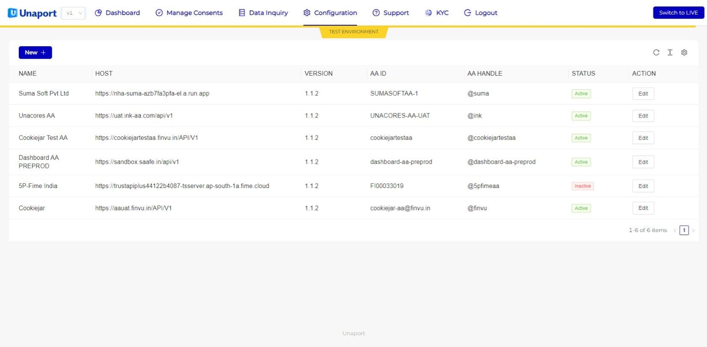
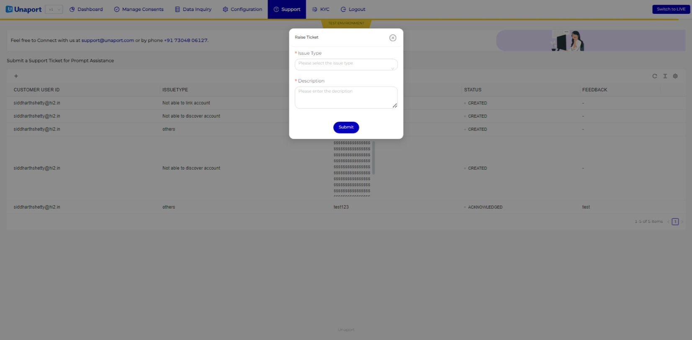
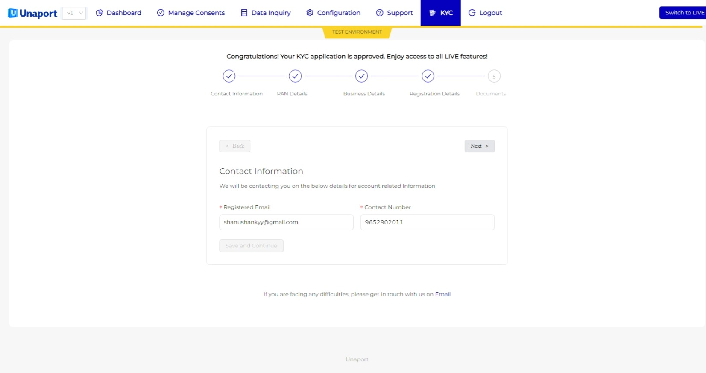

# Financial User Module Manual

## Introduction
The Financial User Module is a platform designed to facilitate the management and monitoring of your financial data securely. Leveraging Account Aggregator technology, it allows you to aggregate your financial information from multiple sources in one centralized location. This manual provides a comprehensive guide to using the module effectively.

## Web Environment URLs

### UAT
- URL: [https://console.sandbox.unaport.com/](https://console.sandbox.unaport.com/)

### Production
- URL: [https://console.premium.unaport.com/](https://console.premium.unaport.com/)

## Dashboard

### Overview Dashboard
The Overview Dashboard serves as the landing page, offering a comprehensive summary of your financial data and activities.

#### Consent Status Breakdown
This section provides a detailed breakdown of the status of consents granted to third-party entities for accessing your financial data. It categorizes consents as active, inactive, or expired.

#### Aggregator-wise Consent Distribution
Here, you can view the distribution of consents across different Account Aggregators. It helps you understand which aggregators have access to your financial information.

#### FIP-wise Consent Overview
This section provides an overview of the consents granted to each Financial Information Provider (FIP). It enables you to track the entities accessing your data.

#### FIP-wise Account Distribution
Displays the distribution of your linked accounts among different Financial Information Providers. It helps you identify which FIPs have access to specific accounts.

#### FI Account by Fetch Types
Illustrates the distribution of accounts based on fetch types (e.g., pull, push) for each Financial Institution. It provides insights into how your data is accessed.

#### Account Type Distribution
Shows the distribution of your linked accounts based on their types (e.g., savings account, credit card, investment account). It gives you an overview of your financial portfolio.

## Manage Consent

### Raise Consent
The Raise Consent feature allows you to grant consent for sharing your financial data with third-party entities securely. Follow these steps to raise a consent:

1. Navigate to the "Manage Consent" section.
2. Click on the "New +" option.
3. Select the desired Product against which you need to raise the Consent.
4. Provide the Tracking ID - Internal Reference Number for your future use.
5. Select the Account Aggregators.
4. Confirm the Consent Details.
5. Submit the consent.

### Approve Consent
After raising a consent, you may be required to review and approve or reject it on the Account Aggregator platform. Follow these steps to approve or reject consent:

1. Upon raising a consent, you will receive a redirection link or notification to review the consent on the Account Aggregator platform.
2. Click on the provided link or log in directly to the Account Aggregator platform.
3. Review the consent details, including the duration and scope of access requested by the third-party entity.
4. Choose to approve or reject the consent based on your preferences.
5. Follow any additional prompts or verification steps as required by the Account Aggregator platform.

## Data Inquiry 

The Data Inquiry feature enables you to request specific financial data from your linked accounts. Here's how to use it:

1. Go to the "Data Inquiry" section.
2. Choose the accounts or data categories you want to inquire about.
3. Click on FI Data.
4. Monitor the status of your inquiry and view data.

### Features of Analytics
The View Analytics section provides a 360-degree view of your financial history by combining data from bank accounts, GST returns, and credit reports. It enables judicious financial decisions through the following features:

- **360-Degree View**: Gain a comprehensive understanding of your financial history by accessing data from bank accounts, GST returns, and credit reports in one place.

- **Holistic Analysis**: Cross-analysis allows for a holistic view of active loans and EMI obligations by matching loans in the credit report with bank transactions. This helps in understanding your financial commitments and managing them effectively.

## Configuration

### Products

The Products configuration allows you to manage the products linked to your profile.The Products are used as a Consent template to be used while raising a Consent.Follow these steps to manage your products:

## Adding a Product

### Steps:

1. **Navigate to the Products Section**: Access the section of your Financial User Module where you can manage products.

2. **Add Product**: Click on the option to add a new product.

3. **Fill in Product Details**: Enter the required information for the new product. Based on the provided fields, you would need to include:

    - **Product Name**: Unique Name for the product.
    - **Detail**: Detailed information about the product, including consent expiry date, FI types, fetch type, purpose, data range, consent types, consent mode, consent expiry, frequency, and data life.
  

4. **Save Product**: Once all necessary information is filled in, save the product.

### Account Aggregator

The Account Aggregator configuration settings are specific to the integration with the Account Aggregator service. Here's how to configure it:

1. Go to the "Configuration" section.
2. Choose the "Account Aggregator" option.
3. Manage API keys, authentication, and integration settings as required.

## Support

The Support section provides assistance and resources for users encountering issues or needing help. Here's what you can find:

- **Contact Information**: Details to reach out to customer support for further assistance.

## KYC

The KYC (Know Your Customer) section facilitates the completion and updating of KYC information to ensure compliance with regulatory requirements and enhance security. Follow the prompts to complete or update your KYC details.
